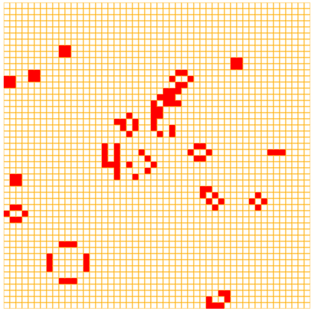
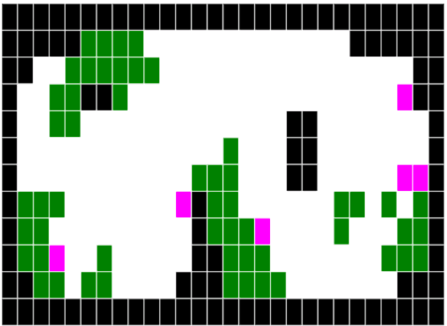

# Javascript Learning Group

Repo for resources &amp; notes for the JS Learning Group by @nhpatt



## Index

* [Values, Types, and Operators](#chapter1)
* [Program structure](#chapter2)
* [Functions](#chapter3)
* [Data Structures: Objects and Arrays](#chapter4)
* [The Secret Life of Objects](#chapter5)
* [Higher order functions](#chapter6)
* [Project: Electronic Life](#chapter7)
* [Conventions, tips & tricks](#notes)

## Values, Types, and Operators
<a name="chapter1"></a>

*Missing description*

### Comments about the exercises

* Chessboard in canvas


<a name="chapter2"></a>
## Program structure

*Missing description*

<a name="chapter3"></a>
## Functions

*Missing description*

<a name="chapter4"></a>
## Data Structures: Objects and Arrays

### Arrays

Like other arrays... with `[]`

With methods like

* `push` (with variable arguments)
* `pop`
* `join`

### Properties

Classic fields, available through dot notation and square brackets (metaprogramming!)

### Objects

* With `{}`
* You can delete a property (very uncommon)
* And check with if a property exists `in`
* Existing values in JS (numbers, strings and booleans) are immutable.

<a name="chapter5"></a>
## Higher order functions

Abstractions hide details and allow us to work in a more abstract level.

* `forEach` is available in arrays
* We can create functions based on parameters
* `apply` let us call a function with an array number of arguments -> `f.apply(null, arguments)` -> calls the function `f` passing `arguments`
* `JSON.stringify` and `JSON.parse` built into the language
* `filter` belongs to the array object, accepts a function to filter.
* `map`, `reduce` in the classic incarnation are also available.
* functional functions are great but be aware of the efficiency
* `bind` let us apply arguments.

<a name="chapter6"></a>
## The Secret Life of Objects

*Missing description*

<a name="chapter7"></a>
## Project: Electronic Life

*Missing description*




<a name="notes"></a>
## Notes from several sessions:res

### Idiomatic JS

* Use always `[]` instead of `new Array()`
* Create objects with `{}`
* Set a default value with `||`, for example:

	```javascript
	var number = something_that_could_be_undefined || 0;
	```

* Check if array is not empty with `if (array.length) {...}` or empty with `!array.length`.
* ‘Double negation operator': `!!variable` to force a cast to boolean.

### Useful constructions

* Module pattern, a way of having *private* methods and properties. Typically similar to: `(function() {} return {})()`. A function that is being executed instantly. For example:

	```javascript
	(function module_pattern_revealed {

	var private_element = 2;

	function example_function() {
	    operate_with_private_element
	}

	return {
	    example_function: example_function
	}

	})();
	```
	
* Understanding prototype: every object is linked to a prototype object from which it can inherit properties. This is done dynamically, so you can decorate language objects like `Array` or all your own objects at the same time.

* Closures: functions can be defined inside of other functions. An inner function of course has access to the parameters and variables of the functions it is nested within. The function object created by a function literal contains a link to that outer context. This is really powerful and can be the origin of strange behaviours with loops and event handlers if not understood correctly.

* Truthy and falsy: a lot of values cast to false, like `undefined` or 0, so in JS we talk about truthy and falsy values (those who cast to true or false, respectively).

* Hoisting: variables and functions are moved to the top of the scope in which are defined.

### This…

We have 4 ways of invoking a function:

1. Method invocation, `this` is the scope of our object.

	```javascript
	var myObject = {
	    value: 0,
	    increment: function (inc) {
	        this.value += typeof inc === 'number' ? inc : 1;
	    }
	};

	myObject.increment(); -> 1
	myObject.increment(2); -> 3
	```
	
2. Function invocation, where `this` is the scope of the “global” object (`window` in a browser).

	```javascript
	myObject.double = function () {
	    var that = this; // Workaround.
	    var helper = function () {
	        that.value = add(that.value, that.value);
	    };
	    helper(); // Invoke helper as a function. 
	};

	// Invoke double as a method.
	myObject.double( );
	```
	
	`helper` is invoked as a function and `this` refers to the global scope.

	The usual workaround is use a variable called `that` or `self` that “caches” the value of `this`.
	
3. Constructor invocation, `this` refers to the scope of our object

	```javascript
	var Quo = function (string) {
	    this.status = string;
	};

	Quo.prototype.get_status = function () { 
	    return this.status;
	};

	// Make an instance of Quo.
	var myQuo = new Quo("value");
	myQuo.get_status() -> value
	```

4. And use `bind`, `apply`, `call`... where the programmer sets the value of `this`.


The only strange behaviour is calling a function with a function invocation (constructor and method works fine).

The bad case is more common as it seems, because event handlers, DOM events, timeouts or other corner cases.

The solutions are:

1. Understand why `this` behaves this way and react accordingly.
2. Program only using properties, constructors (without forgetting new) or use `apply` (and derivates).
3. Create variables like `that`.
4. Don’t use `this` ever.

## Useful links

* [Eloquent Javascript](http://eloquentjavascript.net/)
* [Annotated version](https://watchandcode.com/courses/eloquent-javascript-the-annotated-version)
