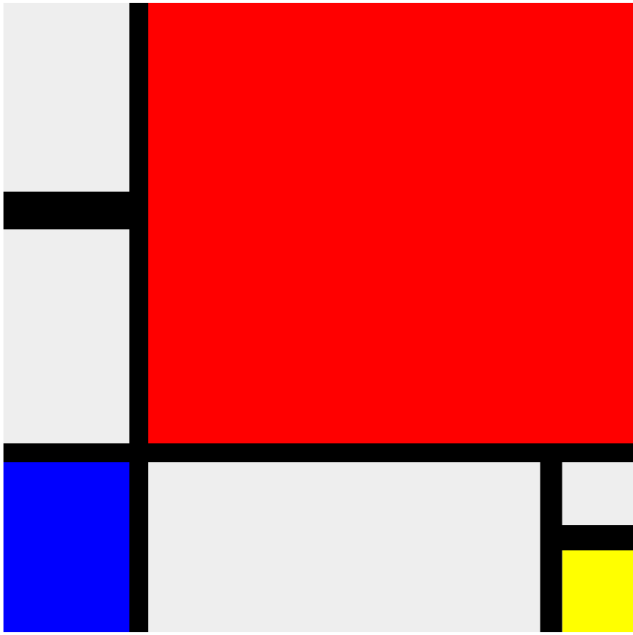

# Season 3 in the Javascript Learning Group

# Katas

* [Basic Generators](https://www.codewars.com/kata/basics-generators-number-1/javascript)
* [Default Rest Spread](https://www.codewars.com/kata/default-plus-rest-plus-spread)
* [Fun with ES6 classes](https://www.codewars.com/kata/fun-with-es6-classes-number-2-animals-and-inheritance/train/javascript)
* [Prime number generator](https://www.codewars.com/kata/prime-number-generator-simple-version)
* [ES5 Generators](https://www.codewars.com/kata/es5-generators-i)

## Reviewed

* [Valid Parenthesis](https://www.codewars.com/kata/52774a314c2333f0a7000688)
* [Moving zeros to the end](https://www.codewars.com/kata/52597aa56021e91c93000cb0)
* [Where my anagrams at](https://www.codewars.com/kata/523a86aa4230ebb5420001e1)
* [Remove duplicates](https://www.codewars.com/kata/train-to-remove-duplicates-from-an-array-with-filter)
* [Simple sequence](https://www.codewars.com/kata/simple-sequence-validator)
* [Numbers in order](https://www.codewars.com/kata/are-the-numbers-in-order)
* [Take or leave it](https://www.codewars.com/kata/take-it-or-leave-it-interview-strategy)

# FIXME

* missing summaries in Eloquent JS
* automate: performance? testing? gulp?

## ES6 & Beyond

[Book](https://github.com/getify/You-Dont-Know-JS/tree/master/es6%20%26%20beyond)

### Chapter 1 - ES? Now & Future

* ES5 is the "current" version in all major browsers (specially IE).
* ES6, now ES2015, is the newer spec.
* Because the support for ES6 is spotty in some browsers (cough, cough), we have to depend on transpilers
	* Basically *translate* from ES6 to ES5 in a new tooling step.
* But we can use polyfills/shims, basically added features (like new functions in ES6) that don't require syntactic changes and can added in older JS versions.

### Chapter 2 - Syntax

* *let* instead of *var*, with block scoping!
* Temporal Dead Zone (TDZ), the place variables occupy when they are not initialized
* *let* in a for loop creates a variable for each iteration of the loop (so closures works as expected)
* *const* are constant (references!)
* Block scoping works! (yay!)
* *...* operator, called *spread* to transform an array to parameters or *rest* to transform parameters to an array.
* *spread* behaves like *apply* with arrays or *concat*
* *rest* behaves like *arguments*
* Default parameters, like:

	```javascript
		function foo(x = 11) {
		
		}
	
	```
* Default parameters can be expressions (functions) or references to other previous parameter
* ...

Repo for resources &amp; notes for the JS Learning Group by @nhpatt


## Old Index

* [Values, Types, and Operators](#chapter1)
* [Program structure](#chapter2)
* [Functions](#chapter3)
* [Data Structures: Objects and Arrays](#chapter4)
* [Higher order functions](#chapter5)
* [The Secret Life of Objects](#chapter6)
* [Project: Electronic Life](#chapter7)
* [Bugs and Error handling](#chapter8)
* [Drawing on Canvas](#chapter16)
* [HTTP](#chapter17)
* [Forms and Form Fields](#chapter18)
* [Conventions, tips & tricks](#notes)

## Values, Types, and Operators
<a name="chapter1"></a>

*Missing description*

### Comments about the exercises

* Chessboard in canvas


<a name="chapter2"></a>
## Program structure

*Missing description*

<a name="chapter3"></a>
## Functions

*Missing description*

<a name="chapter4"></a>
## Data Structures: Objects and Arrays

### Arrays

Like other arrays... with `[]`

With methods like

* `push` (with variable arguments)
* `pop`
* `join`

### Properties

Classic fields, available through dot notation and square brackets (metaprogramming!)

### Objects

* With `{}`
* You can delete a property (very uncommon)
* And check with if a property exists `in`
* Existing values in JS (numbers, strings and booleans) are immutable.

<a name="chapter5"></a>
## Higher order functions

Abstractions hide details and allow us to work in a more abstract level.

* `forEach` is available in arrays
* We can create functions based on parameters
* `apply` let us call a function with an array number of arguments -> `f.apply(null, arguments)` -> calls the function `f` passing `arguments`
* `JSON.stringify` and `JSON.parse` built into the language
* `filter` belongs to the array object, accepts a function to filter.
* `map`, `reduce` in the classic incarnation are also available.
* functional functions are great but be aware of the efficiency
* `bind` let us apply arguments.

<a name="chapter6"></a>
## The Secret Life of Objects

*Missing description*

<a name="chapter7"></a>
## Project: Electronic Life

*Missing description*


<a name="chapter8"></a>
## Bugs and Error Handling

Bugs are unavoidable and we have to learn to deal with them.

* JS is very tolerant with errors and bugs, usually keeps computing until it finishes.
* Calling something that is not a function or looking a property of undefined will halt the program.
* JS can be made more strict by enabling *strict mode* at the top of a file or function.
	* Fails when using variables not defined
	* Fails when using this when functions are not called as methods

	**please, use strict mode**
	
* Do testing, either manually, with a custom method or a library.
* We can do *manual* debugging with `console.log` or a browser.
* How to do error propagation?
	* return `null` or a special value
	* Exceptions!

### Exceptions

* `throw` raises an exception
* `try` and `catch (error)` mechanism.
* `new Error(message)` is the typical object thrown.
* `finally` as everybody is used to.
* JS does not have selective catching of exceptions (for example, we can't define several `catch` clauses).
* But we can create our own exception (should have a name property and an stack like `(new Error()).stack)`.

### Assertions

* We can do custom checks with assets after defining our own custom function.

<a name="chapter16"></a>
## Drawing on Canvas

* SVG = vector shapes, against canvas that is **not** vectorial.
* SVG -> circle, rect elements with xml namespace.
* Canvas -> 2d & 3d (WebGL)

### Canvas

* `<canvas></canvas>` with width and height
* Based on the context object, document.getElementById('').getContext("2d")

<canvas id="example" style="background-color: #DDDDDD"></canvas>

<script type="text/javascript">

var ctx = document.getElementById('example').getContext("2d");
ctx.strokeStyle = 'purple';
ctx.strokeRect(10, 10, 50, 50);

ctx.fillStyle = 'red';
ctx.fillRect(25, 25, 50, 50);

</script>

### Methods

* Vector methods
	* ctx.fillRect(10, 10, 100, 50) and ctx.fillStyle = 'red'
	* fill, give color to an area with fillStyle
	* stroke, give color to a border with strokeStyle
	* lineWidth, to add width to a border
	* path, sequence of lines with beginPath(), moveTo or lineTo and stroke to finish.
	* in a path you can use fill if the path is closed or it will be closed automatically
	* quadraticCurveTo to draw a curve by attracting
	* and bezierCurve
	* and arcTo
* so we can do a pie chart by applying math (:S)

* Text methods
	* `fillText` allows us to paint text (strokeText maybe useful too), with position.

* Images
	* `drawImage` can paint a bitmap image based on a `` but we need to wait until it's loaded.
	* We also can paint sprites (`drawImage` with 9 arguments).

* Transformation
	* `ctx.scale` allows to scale the next thing it's painted.
	* scaling allows negative values to flip things
	* but we hace to play with `translate` and coordinate systems to paint it inside our canvas region

* Store state
	* `save` and `restore` allows us to use a stack of states.

Example in few lines of JS:



<a name="chapter17"></a>
## HTTP

* *GET*, *DELETE*, *PUT*, *POST*...
* 2xx -> **OK**, 3xx -> not here, 4xx -> you messed up, 5xx -> we messed up
* *encodeURIComponent* to encode to url format and *decodeURIComponent* to decode it

### XMLHttpRequest

```javascript
var req = new XMLHttpRequest();
req.open("GET", "example/data.txt", false);
req.send(null);
console.log(req.responseText);
```

* Relative *GET* request
* ...

<a name="chapter18"></a>
## Forms and Form Fields

* Forms are special
* 

<a name="notes"></a>
## Notes from several sessions

### Idiomatic JS

* Use always `[]` instead of `new Array()`
* Create objects with `{}`
* Set a default value with `||`, for example:

	```javascript
	var something_that_could_be_undefined = undefined;
	var number = something_that_could_be_undefined || 0;
	```

* Check if array is not empty with `if (array.length) {...}` or empty with `!array.length`.
* ‘Double negation operator': `!!variable` to force a cast to boolean.

### Useful constructions

* Module pattern, a way of having *private* methods and properties. Typically similar to: `(function() {} return {})()`. A function that is being executed instantly. For example:

	```javascript
	(function module_pattern_revealed() {

	var private_element = 2;

	function example_function() {
	    //operate_with_private_element
	}

	return {
	    example_function: example_function
	}

	})();
	```
	
* Understanding prototype: every object is linked to a prototype object from which it can inherit properties. This is done dynamically, so you can decorate language objects like `Array` or all your own objects at the same time.

* Closures: functions can be defined inside of other functions. An inner function of course has access to the parameters and variables of the functions it is nested within. The function object created by a function literal contains a link to that outer context. This is really powerful and can be the origin of strange behaviours with loops and event handlers if not understood correctly.

* Truthy and falsy: a lot of values cast to false, like `undefined` or 0, so in JS we talk about truthy and falsy values (those who cast to true or false, respectively).

* Hoisting: variables and functions are moved to the top of the scope in which are defined.

### This…

We have 4 ways of invoking a function:

1. Method invocation, `this` is the scope of our object.

	```javascript
	var myObject = {
	    value: 0,
	    increment: function (inc) {
	        this.value += typeof inc === 'number' ? inc : 1;
	    }
	};

	myObject.increment();  // 1
	myObject.increment(2); // 3
	```
	
2. Function invocation, where `this` is the scope of the “global” object (`window` in a browser).

	```javascript
	var myObject = {};
	myObject.double = function () {
	    var that = this; // Workaround.
	    var helper = function () {
	        that.value = add(that.value, that.value);
	    };
	    helper(); // Invoke helper as a function. 
	};

	// Invoke double as a method.
	myObject.double( );
	```
	
	`helper` is invoked as a function and `this` refers to the global scope.

	The usual workaround is use a variable called `that` or `self` that “caches” the value of `this`.
	
3. Constructor invocation, `this` refers to the scope of our object

	```javascript
	var Quo = function (string) {
	    this.status = string;
	};

	Quo.prototype.get_status = function () { 
	    return this.status;
	};

	// Make an instance of Quo.
	var myQuo = new Quo("value");
	myQuo.get_status() // value
	```

4. And use `bind`, `apply`, `call`... where the programmer sets the value of `this`.


The only strange behaviour is calling a function with a function invocation (constructor and method works fine).

The bad case is more common as it seems, because event handlers, DOM events, timeouts or other corner cases.

The solutions are:

1. Understand why `this` behaves this way and react accordingly.
2. Program only using properties, constructors (without forgetting new) or use `apply` (and derivates).
3. Create variables like `that`.
4. Don’t use `this` ever.

## Useful links

* [Eloquent Javascript](http://eloquentjavascript.net/)
* [Annotated version](https://watchandcode.com/courses/eloquent-javascript-the-annotated-version)

## Season 2

# Katas for learning JS

## 8 kyu

### Pending

* [*](https://www.codewars.com/kata/5662292ee7e2da24e900012f)
* [*](https://www.codewars.com/kata/56ae72854d005c7447000023)
* [*](https://www.codewars.com/kata/printing-array-elements-with-comma-delimiters)


### Reviewed

* [regexp basics](http://www.codewars.com/kata/regexp-basics-is-it-a-digit)
* [lario and muigi](http://www.codewars.com/kata/lario-and-muigi-pipe-problem)
* [leonardo dicaprio and oscars](http://www.codewars.com/kata/leonardo-dicaprio-and-oscars)

* [Methods of string object slice substring and substr](http://www.codewars.com/kata/training-js-number-16-methods-of-string-object-slice-substring-and-substr)
* [Loop statement for dot in and for dot of](http://www.codewars.com/kata/training-js-number-12-loop-statement-for-dot-in-and-for-dot-of)
* [Name on billboard](http://www.codewars.com/kata/name-on-billboard)
* [Implement a filter function](http://www.codewars.com/kata/56dd9b84fe5754786f0014f7)
* [Fix your code before the garden dies!](http://www.codewars.com/kata/57158fb92ad763bb180004e7)
* [No zeros for heros](http://www.codewars.com/kata/570a6a46455d08ff8d001002)
* [Opposite number](http://www.codewars.com/kata/opposite-number)
* [noobCode 01](http://www.codewars.com/kata/noobcode-01-supersize-me-dot-dot-dot-or-rather-this-integer)
* [word count](http://www.codewars.com/kata/word-count/javascript)

## 6 kyu

### Pending

* [*](https://www.codewars.com/kata/5616868c81a0f281e500005c)
* [*](https://www.codewars.com/kata/5694d22eb15d78fe8d00003a)
* [Paths in the grid](http://www.codewars.com/kata/paths-in-the-grid)

### Reviewed

* [Decode diagonal](http://www.codewars.com/kata/decode-diagonal)
* [Hangman game](http://www.codewars.com/kata/hangman-game)
* [Next version](http://www.codewars.com/kata/next-version)
* [A memory game array](http://www.codewars.com/kata/a-memory-game-array)
* [Odd/Even number of divisors](http://www.codewars.com/kata/55830eec3e6b6c44ff000040)
* [Reducing by steps](http://www.codewars.com/kata/reducing-by-steps)
* [Magic The Gathering](http://www.codewars.com/kata/magic-the-gathering-number-1-creatures)
* [Bingo card](http://www.codewars.com/kata/bingo-card)

## 4 kyu

### Pending

* [*](https://www.codewars.com/kata/52742f58faf5485cae000b9a)
* [Recover a secret string](http://www.codewars.com/kata/recover-a-secret-string-from-random-triplets)
* [Monads: The list monad](http://www.codewars.com/kata/monads-the-list-monad/javascript)

### Reviewed

* [Next bigger number with the same digits](http://www.codewars.com/kata/next-bigger-number-with-the-same-digits)
* [Explosive sum](http://www.codewars.com/kata/explosive-sum)